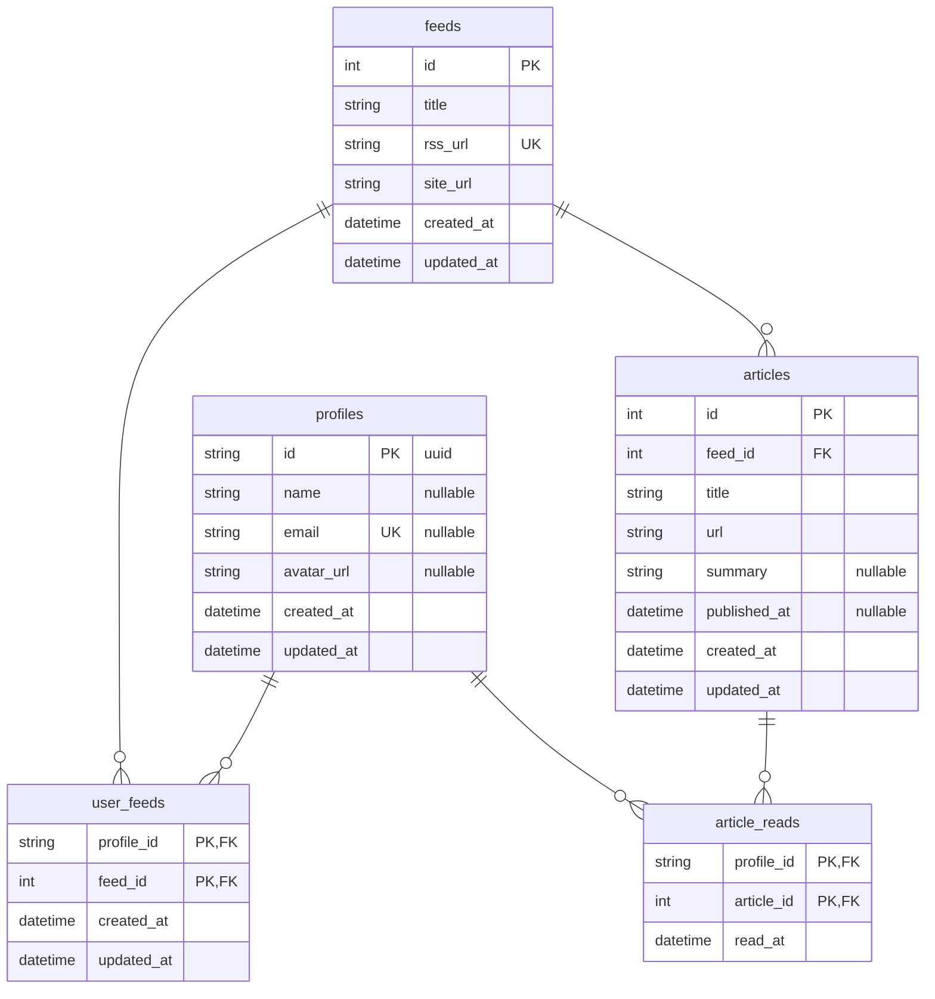

# DB設計
- DBはPostgreSQLを使用し、supabaseを利用して管理する。
- 各テーブルには基本的にcreated_at, updated_atのカラムを作成することを推奨するが、用途に応じて必要なカラムに変更しても構わない。

## ER図

## Index定義
- articlesテーブル
  - feed_id, urlでユニークインデックスを作成する。これにより、同じフィード内で同じURLの記事が重複して保存されるのを防ぐ。
- profilesテーブル
  - emailでユニークインデックスを作成する。ただし、Github認証ではメールアドレスを取得できない場合があるためnullableとする。

## その他制約
- profilesテーブルのidはSupabase Authのauth.users.idをそのまま利用する。auth.users.idはUUIDであり、ログインをGithub認証にし、Supabase Authを利用するため都合が良い。大量にユーザーが登録されることを想定していないため、パフォーマンス懸念はないと考えている。
